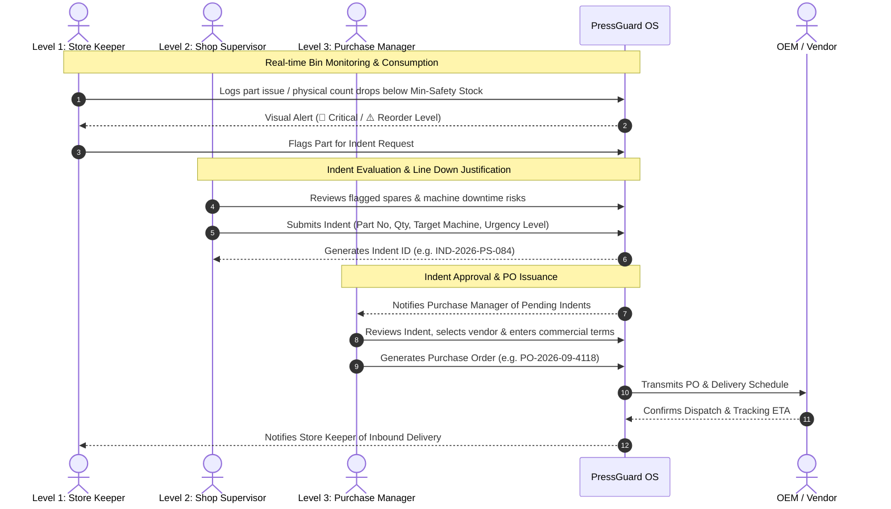

# PressGuard OS: Press Shop Critical Spares Monitoring App
**Application Specification & UI Architecture Document**

---

## 1. Executive Summary & Problem Context

In a modern high-tonnage automotive/sheet metal **Press Shop** (featuring 500T to 2000T mechanical stamping presses, hydraulic blanking lines, and transfer presses), unexpected downtime can cost thousands of dollars per hour. 

A failure of a single critical spare (such as a **Main Ram Hydraulic Seal Kit**, a **Pneumatic Clutch Friction Disc**, a **Dual Monitored Press Safety Valve**, or an **Inductive Die Protection Sensor**) halts the entire press line. 

To eliminate stockout breakdowns, this application delivers a unified, **3-tier role-based monitoring and replenishment workflow**:
1. **Level 1 (Store Keeper)**: Monitors real-time bin quantities, records consumption/issues, tracks safety buffers (Min-Max), and flags urgent shortages.
2. **Level 2 (Shop Supervisor)**: Reviews flagged shortages, evaluates production impact (e.g. breakdown vs. planned maintenance), and raises formal **Purchase Indents (Requisitions)**.
3. **Level 3 (Purchase / Procurement Manager)**: Receives approved indents, allocates approved vendors, inputs commercial terms, and issues binding **Purchase Orders (POs)**.

---

## 2. 3-Tier Role-Based Workflow Matrix

---

## 3. Data Schema & Core Spares Specification

### 3.1 Critical Spares Catalog (Press Shop Domain)

| Part Number | Part Name & Description | Press Line | OEM / Specs | Min / Max | Unit Cost | Lead Time |
| :--- | :--- | :--- | :--- | :--- | :--- | :--- |
| **`PRS-HYD-SL-9042`** | Main Ram High-Pressure Polyurethane Seal Kit (Ø420mm) | 1000T Schuler Hydraulic Blanking | Parker Hannifin / Merkel (315 Bar Shock) | 2 / 5 | \$1,250 | 14 Days |
| **`PRS-CLU-FR-3011`** | Multi-Plate Wet Clutch & Brake Sintered Friction Disc (Ø650mm) | 1200T Komatsu Stamping Press | Ortlinghaus (84 Teeth, <120ms Stop Time) | 3 / 6 | \$840 | 21 Days |
| **`PRS-SEN-PR-8820`** | Heavy-Duty Inductive Die Protection Sensor (M18 PNP NO) | 800T Aida Progressive Press | Omron E2E-X10 (SUS303, IP69K, 400Hz) | 5 / 12 | \$145 | 5 Days |
| **`PRS-LUB-MK-5510`** | Progressive Lubrication Metering Distributor Valve Block (8-Port) | 600T Clearing Tandem Line | Lincoln Helios / SKF (250 Bar, 0.2cc/stroke) | 2 / 4 | \$490 | 10 Days |
| **`PRS-VLV-DS-4402`** | Dual Safety Monitored Solenoid Valve for Clutch/Brake (G 1-1/2") | 1200T Komatsu Press | Ross Controls DM2 Series E (Cat 4 PLe) | 2 / 3 | \$2,180 | 30 Days |
| **`PRS-BSH-BR-7218`** | Self-Lubricating Phosphor Bronze Bolster Bushing (ID 120mm) | 500T Bliss Stamping Press | Sankyo Oilless (Graphite Plugged CuZn25Al5) | 4 / 8 | \$320 | 18 Days |

---

## 4. UI Architecture & Home Screen Layout

The application home screen is structured into 5 cohesive panels:

1. **Header & Persona Switcher Bar**:
   - Live persona switch (`[📦 Store Keeper L1]`, `[📋 Supervisor L2]`, `[💳 Purchase Mgr L3]`).
   - Dynamic context banner detailing permissions and shift status.
   - Quick notification drawer toggle for open Indents and in-transit POs.

2. **KPI Summary Cards**:
   - **Critical Stockouts**: Visual counter for parts at 0 quantity.
   - **Reorder Level Hit**: Parts hovering near safety buffer limits.
   - **Active Indents**: Count and total requisition value waiting for PO conversion.
   - **Inbound Shipments**: POs actively in transit with vendor ETA tracking.

3. **Search & Industrial Filtering Engine**:
   - Part number instant search (supports prefix matching like `PRS-HYD`).
   - Press Machine filter (1200T Komatsu, 1000T Schuler, 800T Aida, 600T Clearing, 500T Bliss).
   - Stock health status filter (`Critical`, `Low Stock`, `Healthy`).

4. **Critical Spares Interactive Cards**:
   - **Technical SVG Schematic**: High-precision vector illustration showing dimensions, seal profiles, and ports.
   - **Header Data**: Prominent Part Number with one-click copy, machine attribution, and criticality indicator.
   - **Stock Progress Bar**: Visual fill gauge showing current inventory vs. Minimum Safety Buffer.
   - **Warehouse Bin & Commercial Data**: Physical location (e.g. `Bay 2 • Rack A1-04`), lead time, and unit price.
   - **Dynamic Role Buttons**:
     - *Store Keeper*: Issue Spares (➖) / Flag for Indent (📢).
     - *Supervisor*: Tech Specs (🔍) / Raise Indent (📋).
     - *Purchase Manager*: Vendor Quotes (📑) / Issue PO (💳).

5. **Integrated Workflow Modals**:
   - **Raise Indent Modal (Supervisor)**: Automatically pulls part number and current stock, calculates reorder deficit, inputs priority (Emergency Breakdown / PM), and registers digital supervisor sign-off.
   - **Issue PO Modal (Purchase Manager)**: Links directly to an open Indent, computes total contract value, specifies delivery terms (Incoterms, Express Air), and generates sequential PO numbers.
   - **Part Technical Sheet Modal**: Full engineering specifications, operating pressures, wear life, and BOM attributes.
   - **Side Pipeline Drawer**: Quick slide-out tracking active Indents and PO delivery statuses.

---

## 5. Live Prototype File

The self-contained interactive web prototype is located at:
`press_shop_spares_app.html`
